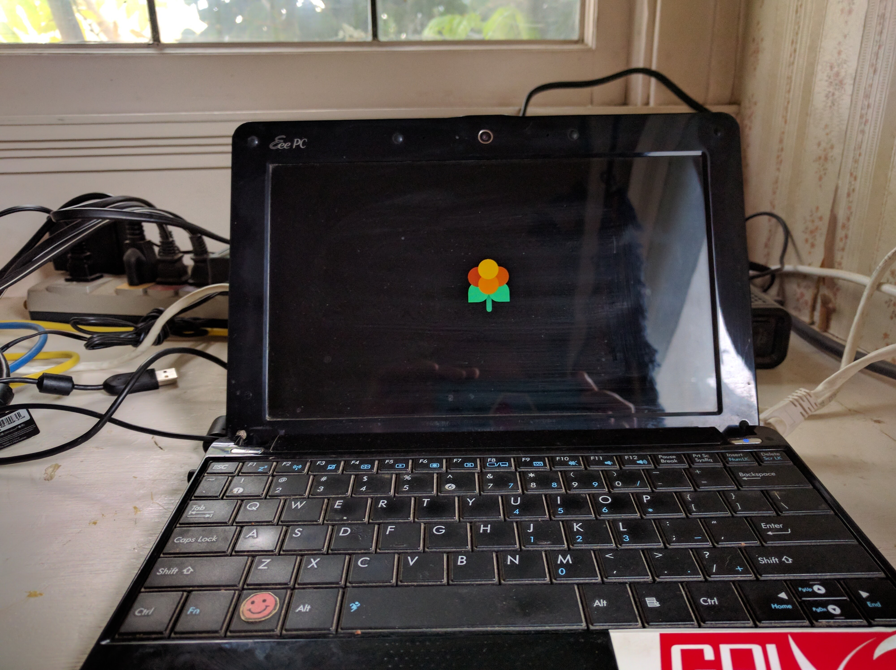
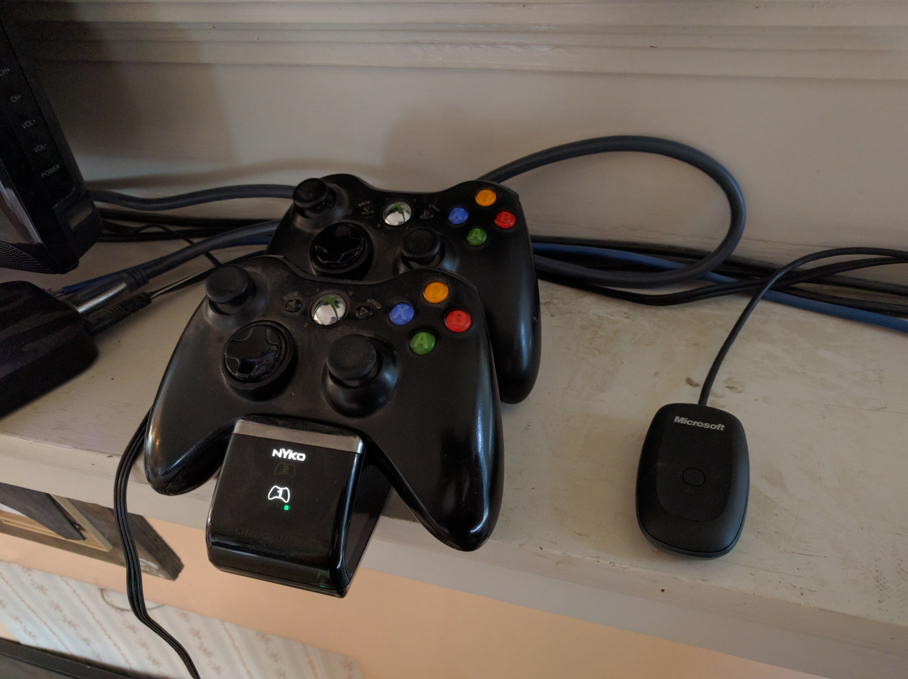
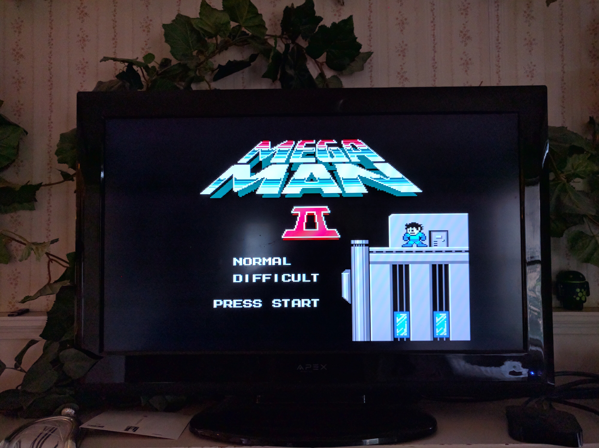

Chache loves old Sega games but I grew up in a Nintendo house so I built an multi-emulator machine.

### Get some hardware, install Lakka and boot up

You'll need an old PC, laptop, or even a RassberryPi, anything you can install linux on. I'm using my ancient but trusty Asus EEE PC.

[Lakka](http://www.lakka.tv/get/) is a linux distro which is mostly just the RetroArch frontend. You could also install LibRetro on an existing linux system through aptitude, but I wanted to do the full OS install.



### Troubleshoot

The first real problem I had was that, by default, my pokey machine couldn't render the complex background of the menu quickly. The result was a nearly unuseable. But by turning off the option `Settings >  Menu > Menu Shader Pipeline` to "off", navigating the menu was much faster. Next, I changed `Settings >  Menu > Show Advanced Settings` to "On", so that I could access "Settings > Video > Monitor Index." Changing this to "2" allowed me to use the VGA connection, rather than the built-in screen.

For the nerds, you can also do this through the command line. First obtain the IP address of the Lakka machine

```
adam@babbage ~/Downloads sudo arp-scan --interface=en0 --localnet
Password:
Interface: en0, datalink type: EN10MB (Ethernet)
Starting arp-scan 1.9 with 256 hosts (http://www.nta-monitor.com/tools/arp-scan/)
192.168.1.1     00:25:9c:66:c5:8d       Cisco-Linksys, LLC
192.168.1.100   70:73:cb:e9:d1:7e       Apple, Inc.
192.168.1.113   00:26:18:41:d9:65       ASUSTek COMPUTER INC.
192.168.1.111   6c:ad:f8:7d:3c:6b       Azurewave Technologies, Inc.
...
```

From this, we see the Asus netbook is online at address 192.168.1.113. Next, I used `ssh` to access the machine. Hint: the username and password are both "root." Yes, this is terrible but I didn't set it up this way!

```
adam@babbage ~/Downloads ssh root@192.168.1.113
root@192.168.1.113's password:
###########################################
# Lakka - The DIY retro emulation console #
# ...... visit http://www.lakka.tv ...... #
###########################################

Lakka (unofficial) Version: devel-20161002110423-r21593-g03241bf
Lakka git: 03241bf2ccf3fbf6f71d04489e02ae3cee8565e1
Lakka:~ #
```

and voila, you have a very simple linux command line. From here, you must first stop RetroArch

```
Lakka:~ # systemctl stop retroarch
```

then you can edit `.config/retroarch/retroarch.cfg`, with `vi` or `nano`. For example, you might change the setting called `video_monitor_index` from "0" to "2." After saving the file, restart RetroArch.

```
Lakka:~ # systemctl start retroarch
```

### Connect and sync controllers



I use Xbox wireless controllers with a charging cradle. Just plug the receiver into the usb of the netbook, press the button and the Xbox button on the controller themselves. They connected right away and I had no problems at all.

### Download ROMs



Get all your ROMs together and use `scp` to move the files onto the netbook. Again, use `arp-scan` to first obtain the IP address of the Lakka machine.

```
scp -r * root@192.168.1.113:roms/
```

Now by returning the the Main Menu, you can select `Main Menu > Load Content`, you run your ROMs.

### Enjoy!

At this point, your system is basically done. I've not been able to load any n64 or playstation games, but all the older systems, including Sega Genesis and arcade seem to work just fine. Just hit "VGA" on the remote and grab a controller!

## further work

### Write playlists

The menu is pretty difficult to navigate, so it would be nicer to have playlists of games. Lakka makes some crude attempts to generate playlists for you but it's pretty lacking. SSH into the machine and use vim to edit the file in `/playlists` [as described here](https://github.com/libretro/Lakka/wiki/Playlists) and lists of games will appear on the root menu.

### Boxart

Lakka can be configured to download the boxart for games.

## Thoughts

When I first booted Lakka, I couldn't accomplish anything because of the lag caused by the background pattern. Considering my netbook has about the stats as a RassberryPi, I think the contributors should set `Menu Shader Pipeline` to "off" by default.

It would be really nice to be able to edit the files from the Finder. You should be able to pick up the filesystem in the sidebar of your file browser. Sometimes this worked, but mostly didn't. 
