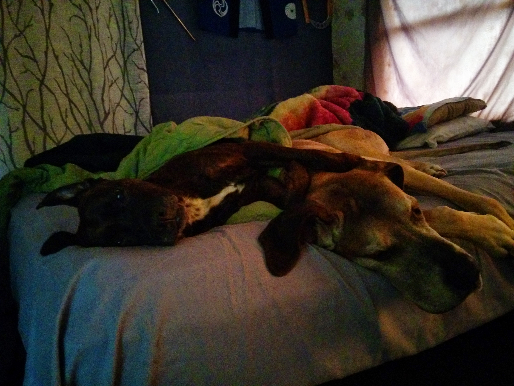

Update: `js-lwip` no longer works with later versions of node. I've since migrated to `@randy.tarampi/lwip`.


Update II: `j@randy.tarampi/lwip` no longer works with later versions of node. I've since migrated to `jimp`.


### An example of my image pipeline.

A blog entry folder may have a `assets.json` file which describes how to process images. You can put your raw images alongside your blog content and the rules with which to manipulate them and webcrack will take care of the reset.

## This is an original picture of my dogs.


## an example asset file
```json
{
  "dogs.jpg": {

    "variant0": [
      {"scale": 0.1},
      {"border": [10, "yellow"]},
      {"rotate": [-100, "green"]},
      {"rotate": [33, "red"]}
    ],

    "variant1": [
      {"scale": 0.2},
      {"blur": 1.1},
      {"pad": [20, 40, 60, 80]},
      {"border": [30, "blue"]}
    ],

    "variant2": [
      {"saturate": -0.95},
      {"scale": 0.1},
      {"setPixel": [100, 100, "red"]},
      {"lighten": 0.9}
    ]

  }
}
```
## The following are variants processed with [lwip](https://www.npmjs.com/package/js-lwip)


---
