My friends and I took a camping trip to the John Day Fossil Beds to see the eclipse.

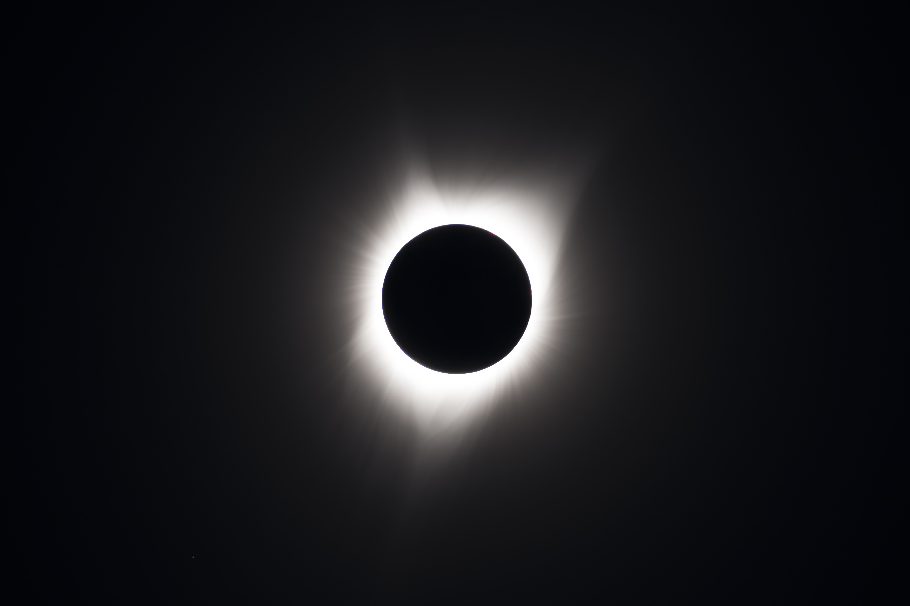

We camped at Dick Creek, which is quite beautiful and has several nearby trails. All the private property nearby was really crowded out but Dick Creek, which is owned by the Bureau of Land Management, was very sparse!

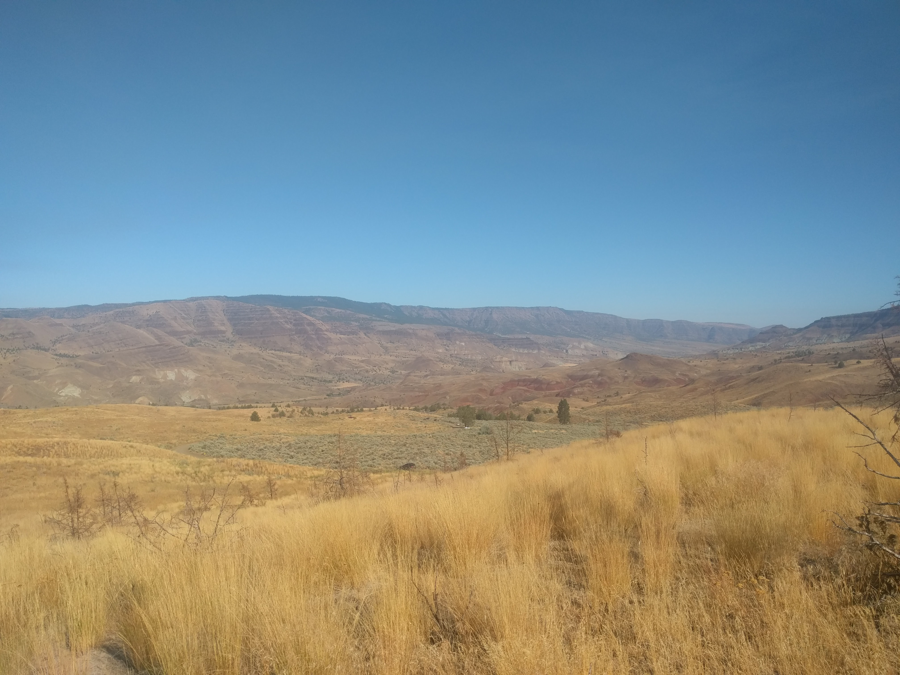

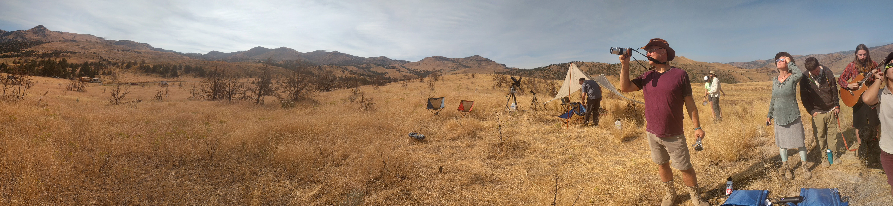

 Along the way, we met Swedish hippies and a NASA engineer Shawn Quinn! His hobby of astrophotography had brought him to our camp site, concluding that of all the places to view the eclipse, given weather and light pollution,  *this exact hillside* was the best place to view the eclipse! (Kudos to my friend Dr. James Cleveland for computing this using his work at Terra Stride)

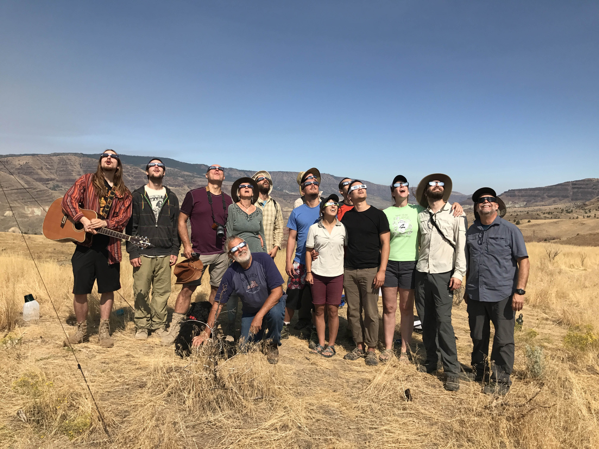
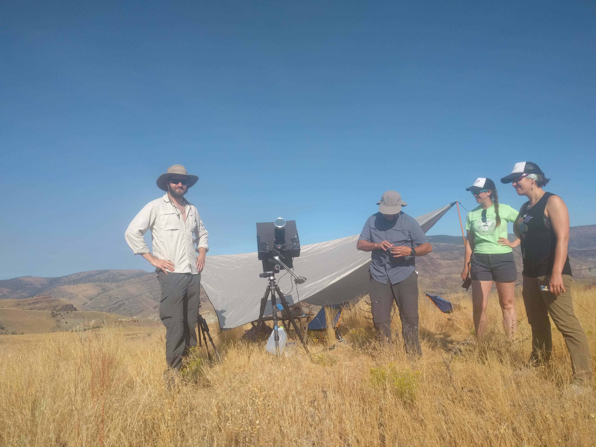
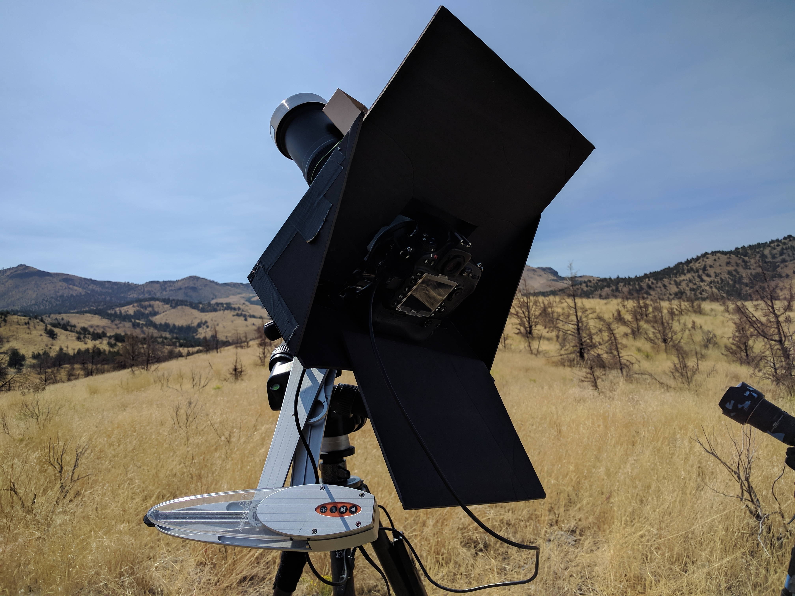

The transit begins
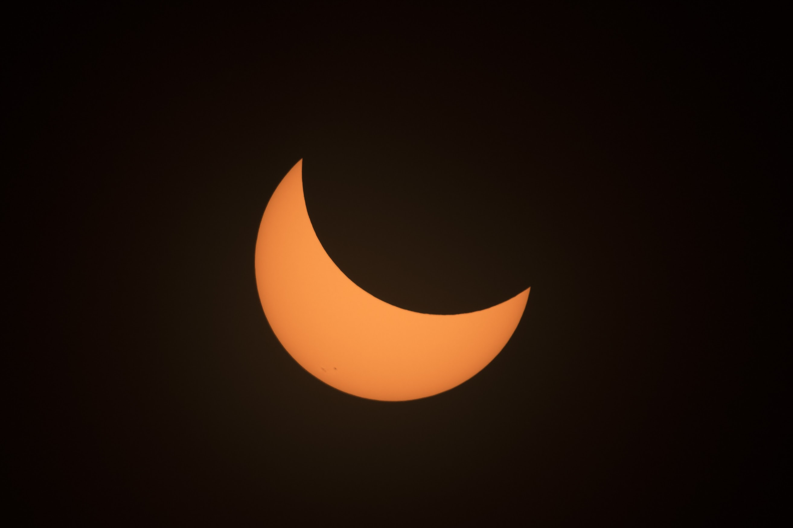

Being so close to the line of totality, we got to experience the beauty of a full solar eclipse for over 2 minutes!
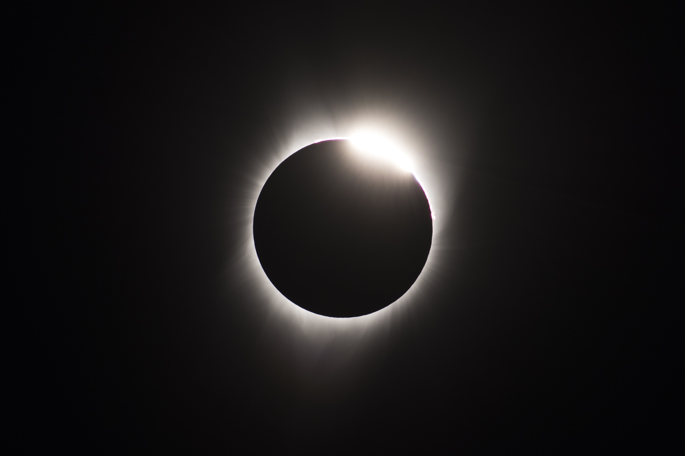

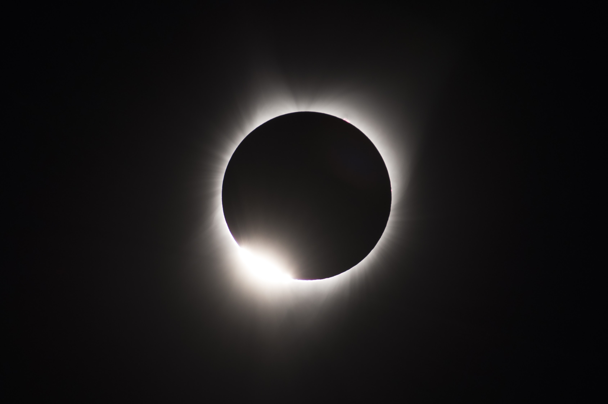

The transit ends
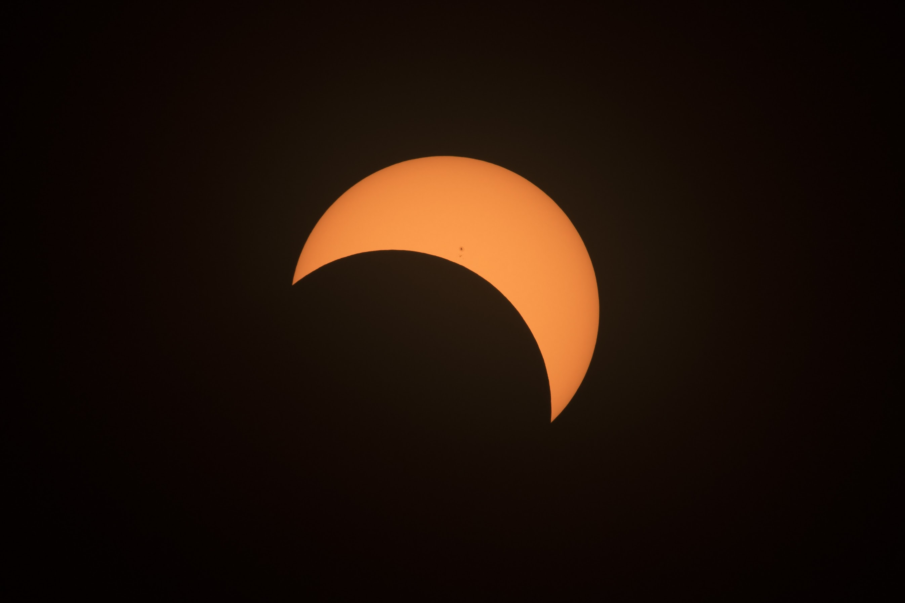

The whole adventure was really magical!
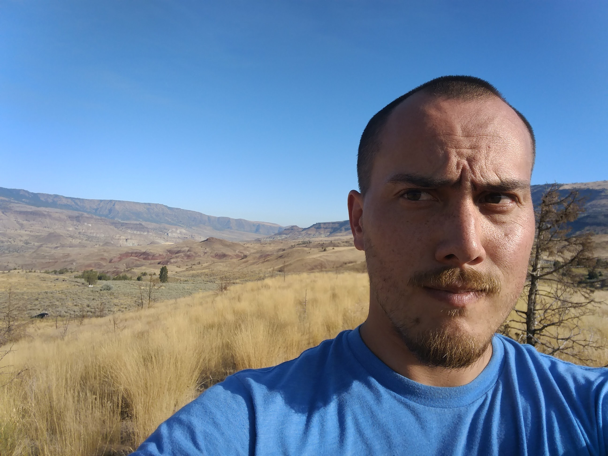

Credits:
Many thanks to Shawn Quinn for sharing some of his astrophotography!
