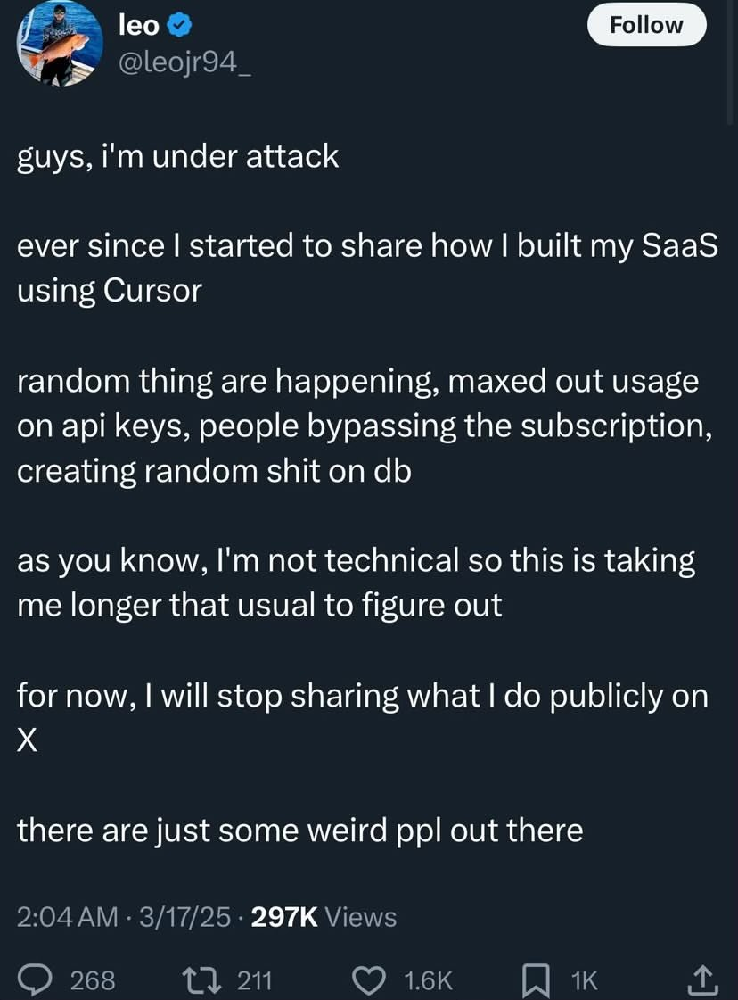

Picture this: you’re chatting with an AI about your web project, saying things like, “Hey, make the sidebar padding smaller,” and it just happens. You hit “Accept All” on the suggestions, skip the nitty-gritty details, and watch your app come to life. It’s coding that feels like a breeze—perfect for weekend experiments or those moments when you just want to see your ideas take shape without overthinking it.

And honestly, vibe coding can be awesome. It’s fast, it’s fun, and it lets you create things in record time. For throwaway projects or quick prototypes, it’s a game-changer. But what if you’re working on something a bit more important—like an app you want to share with friends or even launch for real? 

Ruh-oh.

You might want an app that’s reliable, secure, and doesn’t fall apart the moment someone uses it. That’s where Testeranto comes in—a tool designed specifically to help vibe coders like you make apps that are not just quick to build, but also solid and efficient.

How Testeranto fixes vibe coding

Testeranto was created to take the best parts of vibe coding—the speed, the ease, the creativity—and pair them with a simple way to ensure your app actually works as intended. It’s like having a trusty sidekick that keeps your free-spirited coding on track, without cramping your style.

Here’s how it works: instead of diving straight into the code, you start by describing what you want your app to do in plain, everyday language. For example, you might say, “When someone clicks the login button, they should see their dashboard.” Testeranto takes that description and turns it into a test—a little checkpoint that defines what “success” looks like. Then, whether you’re letting the AI write the code or doing it yourself, that test guides the process. It’s like giving your AI buddy a clear goal to hit, so it doesn’t veer off into chaos.

How It Makes Your Apps Better

With Testeranto, you still get to enjoy the laid-back vibe coding flow, but you end up with apps that are:

- **More Secure**: Those tests help catch mistakes that could leave your app vulnerable, so you don’t have to worry about it breaking in unexpected ways.
- **More Stable**: By checking that the code does what you described, Testeranto ensures your app won’t crash the second someone tries it out.
- **More Efficient**: You avoid messy, roundabout solutions because the tests keep everything focused on what matters.

Think of vibe coding as sketching a cool idea on a napkin—it’s quick and captures your vision perfectly. Testeranto is like turning that sketch into a blueprint, so when you build the real thing, it’s sturdy and functional. You keep the fun of sketching, but you also get a result you can rely on.

No Extra Hassle, Just Extra Confidence

Now, you might be thinking, “Wait, writing tests sounds like a chore!” And yeah, it could be—except Testeranto makes it super simple. You don’t need to learn fancy technical terms or spend hours figuring it out. You just say what you want in your own words, and Testeranto handles the rest. It fits right into your vibe coding routine, so you’re not slowing down—you’re just adding a safety net.

Plus, that little bit of effort upfront saves you tons of time later. Instead of scratching your head over bugs or frantically fixing things after they break, you’ve got tests that catch issues early. It’s like double-checking your work before showing it off, so you can relax knowing it’s good to go.

Why You Should Try It

If you love how fast and easy vibe coding is but want to take your projects to the next level, Testeranto is your perfect match. It doesn’t replace the joy of letting AI whip up code for you—it enhances it. You get the speed you crave, plus the peace of mind that your app is solid enough to share or even launch.

Imagine showing off an app that not only looks cool but works flawlessly, all because you had Testeranto keeping things on point. Whether you’re building something small for fun or a bigger project you’re proud of, Testeranto helps you vibe code with confidence.

Give Testeranto a Spin!

Ready to see how it works? Check out the Testeranto demo and play around with it yourself. It’s a quick, easy way to level up your vibe coding game without losing that chill creative flow. Trust me, once you try it, you’ll wonder how you ever coded without it. Your apps—and your users—will thank you.

